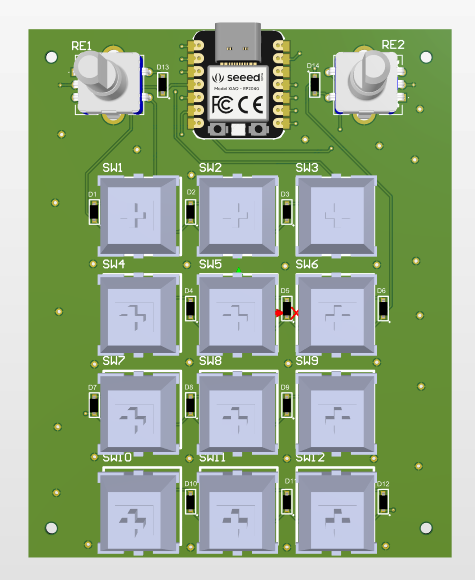

# Tissue Macro Pad

This project is a brand-new, expanded rendition of my original 3-key macropad. 

## Images

## ⚙️ Hardware & Features

This board is  powered by the **XIAO RP2040** and has:

* **12×** Mechanical Key Switches
* **2×** Rotary Encoders
* **Microcontroller:** Seeed Studio XIAO RP2040

## 🚧 Project Status & Roadmap

* **PCB Design:** Complete
* **PCB Manufacturing ETA:** Dunno 🤷‍♂️
* **Case Design ETA:** Dunno 🤷‍♂️
